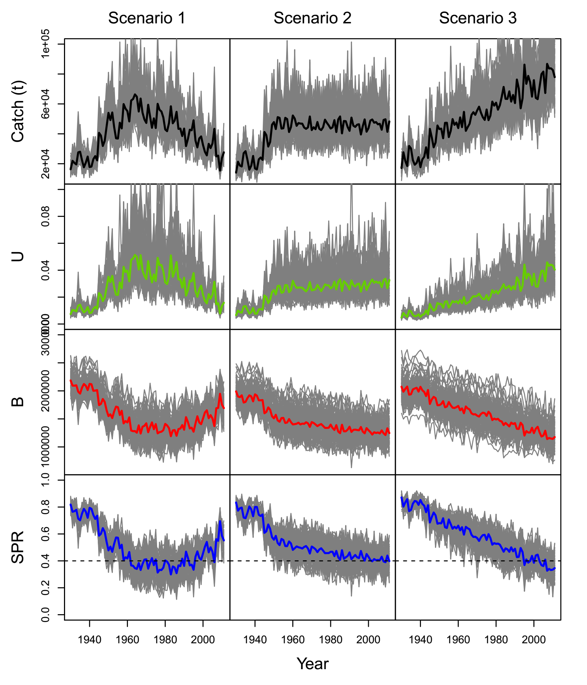
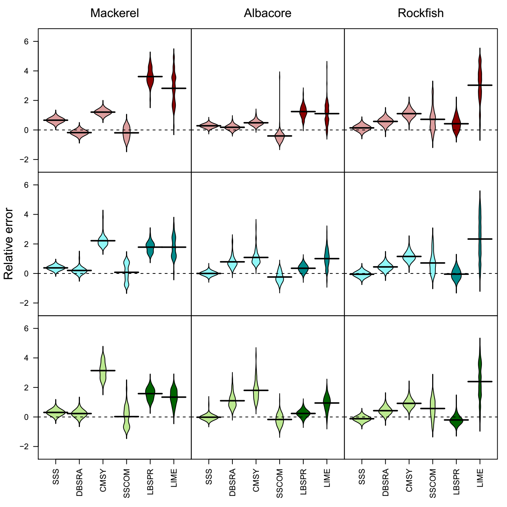

```{r setup, include=FALSE}
knitr::opts_chunk$set(echo      =FALSE)
```

```{r libraries}
library(grid)
library(png)
```


## Tasks

**Develop and test** a range of assessment models and methods to establish **<span style="color:blue">$MSY$</span>** or proxy reference points across the spectrum of data-limited stocks 

<!-- Economic value; Importance; Sensitivity to the impacts of fishing; Available data. -->


+ A number of data-limited methods already exist, therefore implement a **<span style="color:green">Common Framework</span>** to compare performance.

+ Develop **<span style="color:red">Diagnostics</span>** to assess sensitivity to assumptions and bias 

+ Use **<span style="color:purple">Management Strategy Evaluation</span>** to ensure robustness to uncertainty 


## MSY

An objective of the Common Fisheries Programme is to achieve  **<span style="color:blue">$MSY$</span>** for
*<span style="color:green">“all harvested species"</span>*


There is also the fast approaching 2020 deadline for achieving Good Environmental Status to ensure

+ *<span style="color:black">“Stocks should be exploited sustainably consistent with high long-term yields."</span>* 
+ *<span style="color:black">"Populations of all commercially exploited fish and shellfish are within safe biological limits, exhibiting a population age and size distribution that is indicative of a healthy stock.”</span>*

# Data Poor Advice
## Data Poor Advice

Simple catch rules have been developed to stabilise data limited stocks at current levels 

The *<span style="color:purple">"2 over 3"</span>* catch rule adjusts catches based on changes in an index of abundance ($I$)

```{r,fig.height=2.5,fig.width=4}
library(ggplot2)
set.seed(123)
dat=data.frame(y=rlnorm(5)*cumsum(seq(0,.5,length.out=5)),x=1:5)
dt2=data.frame(y=mean(dat$y[1:3]),x=1:3)
dt3=data.frame(y=mean(dat$y[4:5]),x=4:5)
ggplot(aes(x,y),data=dat)+
  geom_point()+
  geom_line(aes(x,y),data=dt2,col="red", lwd=2)+
  geom_line(aes(x,y),data=dt3,col="red", lwd=2)+
  xlab("Year")+ylab("Index")+
  theme_bw()
```

<!-- \tab $C_{y+1}=C_{y-1}\frac{\Sigma^{y-1}_{i=y-3} I_{i}/2}{\Sigma^{y-3}_{i=y-5} I_{i}/3}$ -->


## Common Fisheries Policy

Under the CFP management plans should be delivered through a *<span style="color:purple">results-based approach</span>* that allows tailor-made measures to be proposed in close consultation with fishers and Member States at a regional level.

The  *<span style="color:purple">2 over 3</span>* rule, however, has no reference points to ensure that

+ *<span style="color:green">targets</span>*  are met
+  *<span style="color:red">limits</span>* are avoided with high probability

## Alternatives

**WKLIFE** therefore has proposed and is testing alternative rules that use **<span style="color:blue">$MSY$</span>** proxy reference points e.g. 
 
$C_{y+1}=C_{current}rfb$
 
Where 

+ $r$ is a rule based on an *<span style="color:purple">index of abundance</span>*
+ $f$ is current exploitation rate relative to a *<span style="color:green">proxy</span>* for $F_{MSY}$ 
+ $b$ specifies a *<span style="color:red">threshold</span>* which if the index falls below the catch is reduced.

## *<span style="color:purple">$r$</span>* Trend or Difference

<div class="columns-2">

```{r,fig.height=3,fig.width=3}
library(ggplot2)

lm_eqn = function(m) {
  l <- list(a = format(coef(m)[1], digits = 2),
            b = format(abs(coef(m)[2]), digits = 2));
  #if (coef(m)[2] >= 0)  {
  #  eq <- substitute(italic(y) == a + b %.% italic(x),l)
  #} else {
  #  eq <- substitute(italic(y) == a - b %.% italic(x),l)    
  #}
  
  eq <- substitute(italic(y==a+bx))
  as.character(as.expression(eq));                 
}

set.seed(123)
dat=data.frame(y=rlnorm(5)*cumsum(seq(0,.5,length.out=5)),x=1:5)
dt2=data.frame(y=mean(dat$y[1:3]),x=1:3)
dt3=data.frame(y=mean(dat$y[4:5]),x=4:5)
ggplot(aes(x,y),data=dat)+
  geom_line(aes(x,y),data=dt2,col="red", lwd=2)+
  geom_line(aes(x,y),data=dt3,col="red", lwd=2)+
  geom_point()+geom_smooth(method="lm",se=FALSE)+
  xlab("Year")+ylab("Index")+
  annotate("text", x = 2.2, y = 1.20, label = lm_eqn(lm(x ~ y, dat)), 
                    colour="black", size = 5, parse=TRUE)+
  theme_bw() 
```


if slope $(b) <1$

$C_{y+1}=C_{y-1}({1+k_1b})$

else

$C_{y+1}=C_{y-1}({1+k_2b})$
     
</div>


##  *<span style="color:green">$f$</span>* $F_{MSY}$ Proxies

+ Length as a proxy for F

```{r fig.height=5.5,echo=FALSE}
grid.raster(readPNG("/home/laurence/Desktop/sea++/mydas/project/tasks/task4/tex/FLife-OM-oem-f-1.png"))
```

### Upper Bound  

<div class="columns-2">

+ $b= min\lbrace{ 1,\frac{I_{current}}{I_{trigger}}\rbrace}$
+ $I_{trigger}$ = $wI_{lim}$ ($w > 1$).
+   Needs values of $w$ and $I_{lim}$

```{r,fig.height=3,fig.width=4}
library(ggplot2)

set.seed(16729)
dat=data.frame(x=c(0,1,2),y=c(0,1,1))
rnd=rlnorm(6,log(1),0.3)
dt2=data.frame(y=pmin(1,rnd),x=rnd)
ggplot(aes(x,y),data=dat)+
  geom_line(col="blue")+
  geom_point(aes(x,y),data=dt2,col="red")+
  xlab("Index")+ylab("Multiplier")
```

</div>

# Observation Error Model

## Index of Abundance
```{r fig.height=5.5,echo=FALSE}
grid.raster(readPNG("/home/laurence/Desktop/sea++/mydas/project/tasks/task4/tex/FLife-OM-oem-srvy-1.png"))
```

##  Length Frequency  

```{r fig.height=5.5,echo=FALSE}
grid.raster(readPNG("/home/laurence/Desktop/sea++/mydas/project/tasks/task4/tex/FLife-OM-lfq-1.png"))
```

# Length Based Methods

##  $F_{MSY}$ Proxies

Based on Beverton and Holt  $L_{F} = \frac{L\infty +\frac{F+M}{K}L_c}{1+\frac{F+M}{K}}$

+ $L_{current}/L_{F=M}$ 
+ $M/(Z_{current}-M)$
+ $F_{0.1}/(Z_{current}-M)$
+ $LBSPR$ Length-based spawning potential ratio (Hordyk et al. 2015a) 
+ $Lime$ (Rudd and Thorson, 2018) mixed effects non-equilibrium
+ ...


## Length Based Methods
### Selection Pattern

```{r fig.height=5.5,echo=FALSE}
grid.raster(readPNG("/home/laurence/Desktop/sea++/mydas/meetings/wklifeiiiv/maite-l-sel.png"))
```

## Evaluation
```{r fig.height=5.5,echo=FALSE}
grid.raster(readPNG("/home/laurence/Desktop/sea++/mydas/meetings/wklifeiiiv/maite-l.png"))
```

# Management Strategy Evaluation
## Management Strategy Evaluation
 
Construct an **<span style="color:blue">Operating Model</span>** (OM) to simulate stocks with different life and exploitation histories 

Generate different types of datasets using an **<span style="color:green">Observation Error Model</span>**  (OEM). 

Test Alternative  *<span style="color:red">Management Procedures</span>*

+  Assessment Methods 
+  Reference Points and 
+  Advice Rules

## Operating Model
Life History Relationships

```{r fig.height=5,echo=FALSE}
grid.raster(readPNG("/home/laurence/Desktop/sea++/mydas/project/papers/FLife/tex/figsfb-1.png"))
```
 
## Natural Mortality

```{r fig.height=5.5,echo=FALSE}
grid.raster(readPNG("/home/laurence/Desktop/sea++/mydas/project/papers/FLife/tex/figsm-1.png"))
```

## Case Studies

Turbot, Brill, Pollack, Ray, Sprat, Lobster, Razors

```{r fig.height=4,echo=FALSE}
grid.raster(readPNG("/home/laurence/Desktop/sea++/mydas/project/tasks/task4/tex/om/turbot-pairs-1.png"))
```

## Life History Relationships
```{r fig.height=5.5,echo=FALSE}
grid.raster(readPNG("/home/laurence/Desktop/sea++/mydas/project/papers/randomGrid/tex/fig1.png"))
```

## Biology 
```{r fig.height=5.5,echo=FALSE} 
grid.raster(readPNG("/home/laurence/Desktop/sea++/mydas/project/tasks/task4/tex/om/turbot-vectors-1.png"))
```

## Equilibrium and Reference Points
```{r fig.height=5.5,echo=FALSE}
grid.raster(readPNG("/home/laurence/Desktop/sea++/mydas/project/tasks/task4/tex/om/turbot-eqRun-1.png"))
```

## Reference Points 
```{r fig.height=5.5,echo=FALSE}
grid.raster(readPNG("/home/laurence/Desktop/sea++/mydas/project/papers/randomGrid/tex/fig2.png"))
```

## Operating Model
```{r fig.height=5.5,echo=FALSE}
grid.raster(readPNG("/home/laurence/Desktop/sea++/mydas/project/tasks/task4/tex/om/turbot-ts-1.png"))
```

## Estimate of **F** using LBSPR 
```{r fig.height=5.5,echo=FALSE}
grid.raster(readPNG("/home/laurence/Desktop/sea++/mydas/project/tasks/task4/tex/simtest/lbspr-turbot-fm-1.png"))
```

# Length v Catch Methods

## Scenarios
Stock trends

```{r ,echo=FALSE, out.width="50%"}

```

## Evaluation

```{r ,echo=FALSE, out.width="70%"}

```

## Biomass Dynamic; Cat. 1  
```{r fig.height=4.5,echo=FALSE}
grid.raster(readPNG("/home/laurence/Desktop/sea++/mydas/project/tasks/task4/tex/simtest/bd-turbot-1.png"))
```

## Catch Only 
```{r fig.height=4.5,echo=FALSE}
grid.raster(readPNG("/home/laurence/Desktop/sea++/mydas/project/tasks/task4/tex/simtest/bdsra-turbot-plot-1.png"))
```

## Performance Measures

Under the MSFD, GES Descriptor 3 requires that stocks should be 

+ Exploited sustainably consistent with high long-term yields
+ Have full reproductive capacity in order to maintain stock biomass
+ Proportion of older and larger fish/shellfish should be maintained (or increased) being an indicator of a healthy stock

## Empirical HCR

<div class="columns-2">

```{r,fig.height=3,fig.width=3}
library(ggplot2)

lm_eqn = function(m) {
  l <- list(a = format(coef(m)[1], digits = 2),
            b = format(abs(coef(m)[2]), digits = 2));
  #if (coef(m)[2] >= 0)  {
  #  eq <- substitute(italic(y) == a + b %.% italic(x),l)
  #} else {
  #  eq <- substitute(italic(y) == a - b %.% italic(x),l)    
  #}
  
  eq <- substitute(italic(y==a+bx))
  as.character(as.expression(eq));                 
}

set.seed(123)
dat=data.frame(y=rlnorm(5)*cumsum(seq(0,.5,length.out=5)),x=1:5)
dt2=data.frame(y=mean(dat$y[1:3]),x=1:3)
dt3=data.frame(y=mean(dat$y[4:5]),x=4:5)
ggplot(aes(x,y),data=dat)+
  geom_line(aes(x,y),data=dt2,col="red", lwd=2)+
  geom_line(aes(x,y),data=dt3,col="red", lwd=2)+
  geom_point()+geom_smooth(method="lm",se=FALSE)+
  xlab("Year")+ylab("Index")+
  annotate("text", x = 2.2, y = 1.20, label = lm_eqn(lm(x ~ y, dat)), 
                    colour="black", size = 5, parse=TRUE) 
```


if slope $(b) <1$

$C_{y+1}=C_{y-1}({1+k_1b})$

else

$C_{y+1}=C_{y-1}({1+k_2b})$
     
</div>

## Performance Measures

### **Safety**
+ Probability of avoiding limits <span style="color:red">>$B_{lim}$</span>

### **Status**
+ Probability of achieving targets, recovery and long-term <span style="color:green">>$B_{MSY}$ & >$F_{MSY}$</span>

### **Yield**
+ **<span style="color:blue">$Yield:MSY$</span>**

### **Variability**
+ Inter-Annual variability

## Performance Measures

```{r fig.height=5.5,echo=FALSE}
grid.raster(readPNG("/home/laurence/Desktop/sea++/mydas/project/papers/randomGrid/tex/rg-pmeasures-1.png"))
```

## Utility Functions

```{r fig.height=5.5,echo=FALSE}
grid.raster(readPNG("/home/laurence/Desktop/sea++/mydas/project/papers/randomGrid/tex/rg-utilplot-1.png"))
```

<!-- ## Time Series I -->

<!-- ```{r fig.height=5.5,echo=FALSE} -->
<!-- grid.raster(readPNG("/home/laurence/Desktop/sea++/mydas/project/papers/randomGrid/tex/rg-smry-plot-1.png")) -->
<!-- ``` -->

<!-- ## Time Series II -->

<!-- ```{r fig.height=5.5,echo=FALSE} -->
<!-- grid.raster(readPNG("/home/laurence/Desktop/sea++/mydas/project/papers/randomGrid/tex/rg-smry-plot-2-1.png")) -->
<!-- ``` -->


# Conclusions
## Conclusions
### **Risk**
An uncertainty that matters, what matters are management objectives

### **Management Procedures**
Consider the data along with the assumptions, estimator and management and feedback between the various elements

### **Value of infomation**
Models are cheap, but data is expensive

### **Diagnostics**
Compare across species, stocks, fisheries and advice rules

## R Packages

+ FLR
    + FLife
    + mydas
    + mpb
+ R Packages
    + LBSPR
    + MLZ
    + ...
